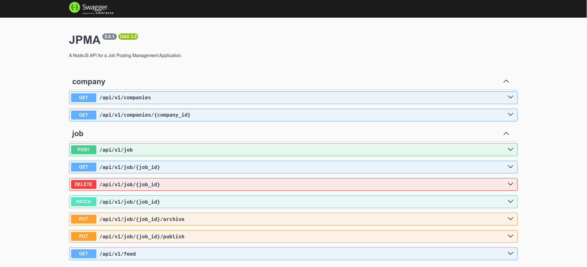

<p align="center">
  <h5>Desafio técnico para Desenvolvedor Backend</h5>
  <h1>Gerenciamento de postagens de emprego</h1>
</p>

<br>

<p align="center">
  <a href="#Project">Projeto</a>&nbsp;&nbsp;&nbsp;|&nbsp;&nbsp;&nbsp;
  <a href="#Recursos">Recursos</a>&nbsp;&nbsp;&nbsp;|&nbsp;&nbsp;&nbsp;
  <a href="#Tecnologias">Tecnologias</a>&nbsp;&nbsp;&nbsp;|&nbsp;&nbsp;&nbsp;
  <a href="#Metodologias">Metodologias</a>&nbsp;&nbsp;&nbsp;|&nbsp;&nbsp;&nbsp;
  <a href="#Funcionalidades">Funcionalidades</a>&nbsp;&nbsp;&nbsp;|&nbsp;&nbsp;&nbsp;
  <a href="#Amostras">Amostras</a>&nbsp;&nbsp;&nbsp;|&nbsp;&nbsp;&nbsp;
  <a href="#Como utilizar">Como utilizar</a>&nbsp;&nbsp;&nbsp;|&nbsp;&nbsp;&nbsp;
</p>

<br>

# Project

O principal objetivo deste projeto é prover uma aplicação para gerenciamento de postagens de emprego. Através dela será possível criar novas postagens, bem como gerenciá-las.

# Recursos

**Principais casos de uso**

- Criar uma nova postagem de emprego: realiza um cadastro básico de postagens de emprego com o status padrão "draft".
- Atualizar uma postagem de emprego: atualiza campos `title, description, location`.
- Deletar uma postagem de emprego: funcionalidade para excluir uma postagem.
- Publicar uma postagem de emprego: ato de publicar um rascunho de postagem. Apenas postagens com o status `draft` ou `archived` podem ser publicadas.
- Arquivar uma postagem de emprego: ato de arquivar uma postagem já publicada
- Exibir um feed de postagens de emprego publicadas: carrega o feed de empregos através do **Redis**, que é atualizado de acordo com o bucket S3 da AWS.

**Casos de uso acessórios**

- Procurar postagem de emprego por ID
- Listar todas as empresas
- Procurar empresa por ID

**Testes unitários**

Foram aplicados testes unitários nas camadas de aplicação (serviços) e apresentação (controladores).

Os testes unitários podem ser executados através do comando `npm run test`

# Tecnologias

- NPM
- Node.js
- Nest.js
- Nest Logger
- Nest Global exception filter
- Nest class-validator
- Arquitetura modular do Nest
- PostgreSQL
- TypeORM
- AWS SQS
- AWS S3
- AWS Lambda
- Jest
- Git
- Swagger
- Express
- ESLint

# Metodologias

Foram aplicadas boas práticas de design e arquitetura de projetos como:

- Clean Architecture
- DDD
- TDD
- Conventional Commits
- GitFlow
- Modular Design
- Dependency Diagrams
- Dependency Injection
- Use Cases

A estrutura do projeto, bem como documentação sobre casos de uso e diagramas de contexto, podem ser apreciados no diretório de [artefatos](https://github.com/vieira-a/backend-developer-test/tree/andersonvieira/artifacts)

# Funcionalidades

Os principais requisitos de funcionalidades estão descritas em:

[Requeriments](https://github.com/vieira-a/backend-developer-test/blob/master/README.md)

# Amostras

- Swagger

<p align="center">
  
</p>

# Como utilizar

**1. Requisitos**

Certifique-se de possuir os itens abaixo instalados:

- [Node.js](https://nodejs.org/en/download)
- [NPM](https://docs.npmjs.com/)
- [Docker](https://www.docker.com/)
- [Git](https://git-scm.com)

**2. Clone este repositório**

`git@github.com:vieira-a/backend-developer-test.git`

**3. Configure variáveis de ambiente**

- Crie um arquivo `.env` na raiz do projeto de acordo com o arquivo `.env.example`:

```
API_HOST_DEVELOP=
NODE_ENV=
API_HOST_PRODUCTION=
API_PORT=
DATABASE_HOST=
DATABASE_PORT=
DATABASE_NAME=
DATABASE_USERNAME=
DATABASE_PASSWORD=
DATABASE_ADMIN_EMAIL=
AWS_SQS_URL=
AWS_REGION=
AWS_ACCESS_KEY_ID=
AWS_SECRET_ACCESS_KEY=
AWS_BUCKET=
AWS_BUCKET_KEY=
REDIS_URL=
REDIS_PORT=
```

Esses dados serão utilizados para criar o containeres do banco de dados **PostgreSQL**, da interface de gerenciamento do banco de dados, o **pgAdmin**, uma instância do **Redis**, e também será necessário para realizar as integrações com os serviços da Amazon Web Services - AWS.

**4. Crie e execute os containers necessários**

`docker-compose up -d`

**5. Instale as dependências do projeto**

`npm install`

**6. Crie o modelo de tabelas no banco de dados**

Execute a query contida _src/infrastructure/database/sql/scripts/models.sql_ para criar as tabelas no banco de dados.

**7. Inicialize a aplicação**

`npm run start:dev`

**8. AWS Lambda**

O arquivo de exemplo da função lambda está localizada em: `src/infrastructure/aws/lambda/lambda_function.zip`

Para executá-la, siga os passos necessários:

- Crie uma nova função Lambda no ambiente da AWS Lambda, observando todas as configurações de papeis e funções necessárias;

- Configure as variáveis de ambiente da lambda AWS com as seguintes chaves;

```
AWS_SQS_URL=
AWS_REGION=
AWS_ACCESS_KEY_ID=
AWS_SECRET_ACCESS_KEY=
AWS_BUCKET=
DB_CONNECTION_STRING=
```

- Importe o arquivo _lambda_function.zip_ para a sua função Lambda.

**9. Acesso**

- API: http://localhost:3000/api/v1
- Documentação: http://localhost:3000/api/v1/docs
